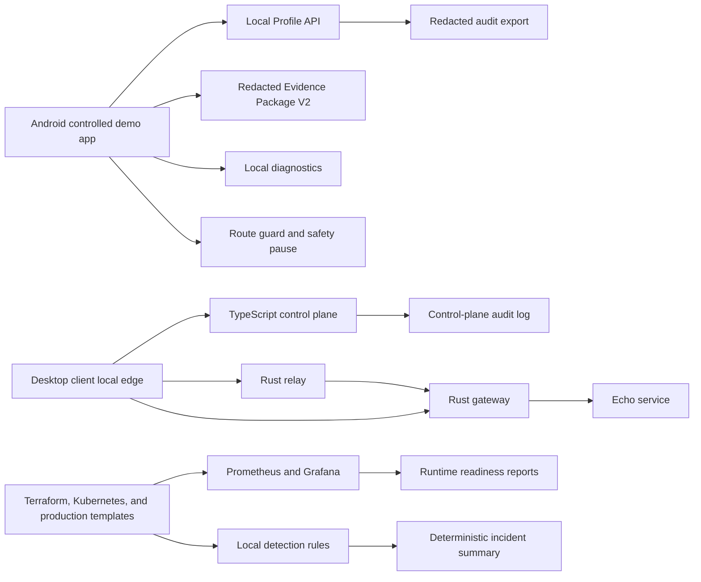
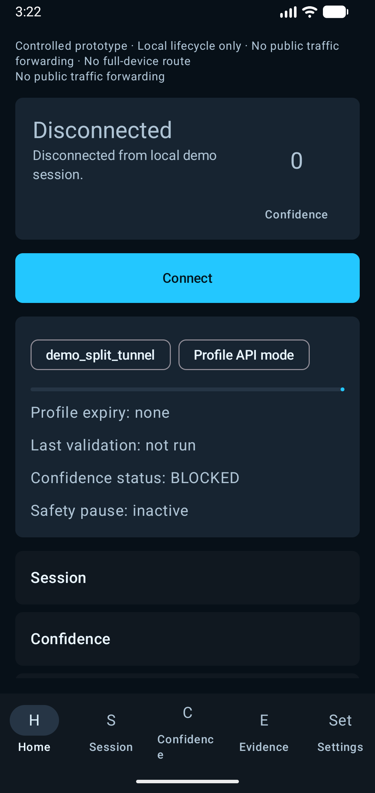
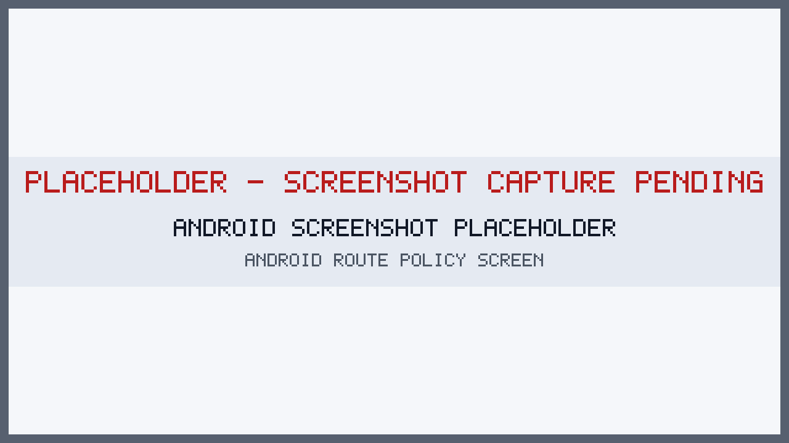
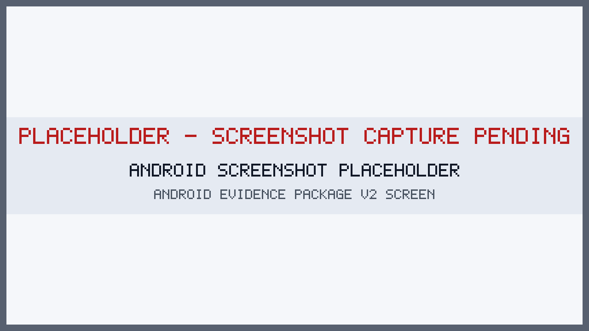
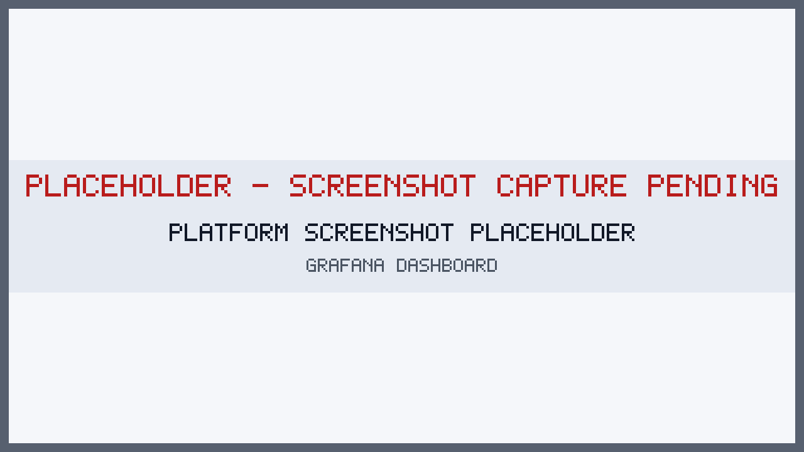
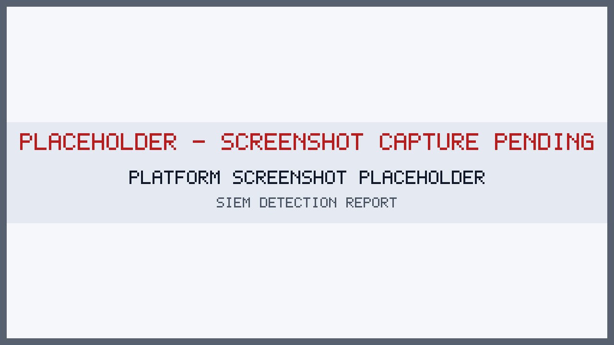
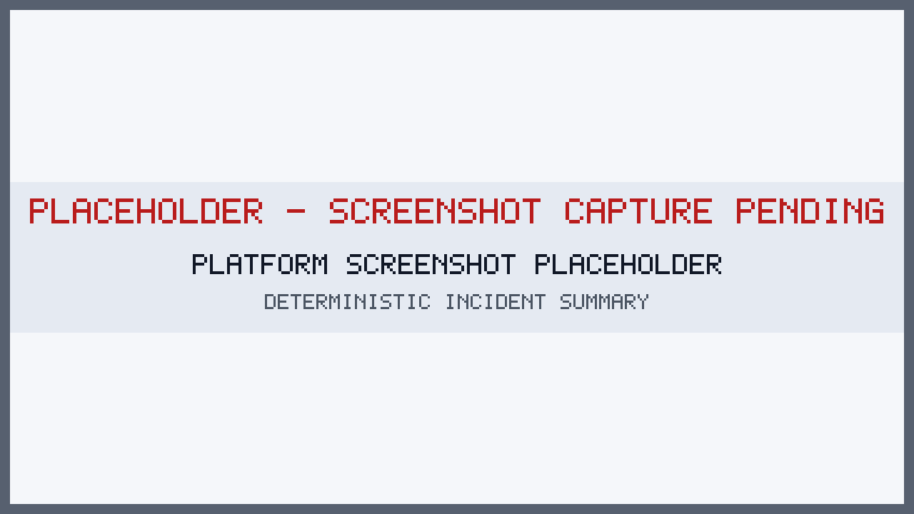

# Gozar/Gorz

Controlled local-first prototype release candidate for Android session lifecycle, local profile issuance, Gozar Core service-to-service routing, evidence export, diagnostics, platform automation, observability, SIEM-style detection, deterministic incident summaries, and production-readiness hardening.

Static review labels, not live CI badges:

- Controlled Release Candidate
- Production: READY
- Production-ready for real use: NO

## Safety Disclaimer

Gozar/Gorz is for authorized local demo, research, review, and stakeholder evaluation only. It is not production secure, not a production VPN, not a public routing product, not a field-deployment routing product, and not a circumvention tool.

Safety boundaries:

- No public traffic forwarding.
- No full-device Android route.
- No public gateway discovery.
- No public relay discovery.
- No public network probing.
- No automatic diagnostic upload.
- No contacts, phone number, location, or public IP history collection.
- No production deployment claim from the provided production templates.

## Current Scope

The repository currently combines two controlled tracks:

1. **Gorz Android controlled demo:** Android session lifecycle, local profile flow, offline demo mode, diagnostics, evidence export, safety pause, and reviewer-facing product screens.
2. **Gozar Core routing lab:** Rust dataplane services, TypeScript control plane, Docker Compose lab, relay and gateway routing, signed local control messages, bounded queues, and production-readiness hardening artifacts.

The latest production-hardening update keeps the local demo intact while making unsafe defaults explicit and adding production-oriented templates for future implementation.

## Four-Phase Roadmap

1. Phase 1: Local Profile Lifecycle
2. Phase 2: Android VpnService Prototype
3. Phase 3: Clickable Android Product Experience
4. Phase 4: Controlled Release Readiness

Roadmap: [docs/product/four-phase-roadmap.md](docs/product/four-phase-roadmap.md)

## Architecture



## Repository Structure

```text
android/gorz/                 Android app
python/profile_api/           local Profile API
python/gorz_api/              local Gorz API prototype
rust/                         Gozar Core Rust libraries and services
ts/                           TypeScript control plane and shared packages
infra/terraform/              Terraform local lab shape
deploy/kubernetes/            Kubernetes manifests and overlays
deploy/production/            inert production-oriented Docker and Kubernetes templates
observability/                Prometheus and Grafana assets
security/detection/           local rules and redacted sample events
ai/incident-summary/          deterministic incident summary demo
docs/                         product, platform, security, privacy, release, and production docs
scripts/                      readiness, safety, screenshot, report scripts
runtime/reports/              generated local reports
```

## Quick Start

### Controlled Readiness Checks

```bash
make phase4-check
make phase4-10of10-check
make production-readiness-check
```

Optional Android, emulator, Terraform, Kubernetes, and screenshot tooling reports `SKIPPED` or `PARTIAL` when unavailable. Reports are generated under `runtime/reports/` and safe examples are copied to [docs/reports/examples/](docs/reports/examples/).

### Gozar Core Local Lab

The local Docker Compose path now uses explicit demo secrets from `.env.example`. Known demo credentials are rejected unless local-dev mode is enabled.

```bash
cp .env.example .env
docker compose up --build
```

Expected externally reachable local ports:

- `7000`: desktop client local edge listener
- `8080`: control plane

Send a local test payload:

```bash
printf 'hello from direct path\n' | nc 127.0.0.1 7000
```

Force relay-path routing through the control plane:

```bash
curl -X POST http://127.0.0.1:8080/api/v1/admin/preferred-path \
  -H 'content-type: application/json' \
  -H "x-gozar-admin-token: ${GOZAR_ADMIN_TOKEN}" \
  -d '{"preferred_path":"relay","switch_reason":"simulate direct path degradation"}'
```

Detailed local instructions: [docs/local-run.md](docs/local-run.md)

## Production-Readiness Hardening

The repository includes production-oriented artifacts, but these are templates and planning assets only. They do not make the system production-ready for real use.

Added or hardened areas:

- `.env.example` for explicit local demo defaults.
- Docker Compose interpolation for control-plane and admin secrets.
- Startup guardrails that reject known demo defaults unless `GOZAR_ALLOW_INSECURE_DEV_DEFAULTS=true`.
- Signed local control messages, timestamp freshness, and process-local replay checks.
- Bounded in-flight queues for client, relay, and gateway services.
- Production Dockerfile templates for Rust services and the TypeScript control plane.
- Kubernetes production base templates for control plane, relay, gateway, namespace, services, probes, resource limits, restricted pod security, and NetworkPolicy.
- Production workflow example for future CI/CD release gates.
- Gozar Core production plan and gap analysis.

Key entry points:

- Production plan: [docs/production/gozar-core-production-plan.md](docs/production/gozar-core-production-plan.md)
- Production templates: [deploy/production/README.md](deploy/production/README.md)
- Production workflow example: [docs/production/examples/github-actions-production.yml](docs/production/examples/github-actions-production.yml)

Before real deployment, replace demo HMAC secrets, static admin tokens, process-local replay caches, local JSON state, self-signed QUIC trust, and template images with approved production identity, storage, certificate, signing, observability, and release controls.

## Android Demo

Open `android/gorz` in Android Studio and run on a Pixel 2 API 30 emulator. Offline demo mode works without the local Profile API.

```bash
make android-emulator-smoke-report
make phase4-screenshot-report
```

The Android app includes Home, offline connect flow, session dashboard, deterministic confidence, route policy, local diagnostics, Evidence Package V2, safety pause, audit, settings, and storage mode views.

### Android Phase 2 Prototype

Phase 2 introduced the local Android VpnService lifecycle prototype, Profile API integration, profile validation, route safety, local TUN lifecycle, packet counting, packet dropping, and no public forwarding.

### Android Phase 3 Clickable Prototype

Phase 3 introduced the clickable Android product experience: onboarding, home, connect flow, session dashboard, confidence, route policy, diagnostics, evidence, safety pause, audit, settings, offline demo mode, and emulator smoke coverage.

## Screenshots

Screenshot status: [docs/vpn-product/images/phase4/README.md](docs/vpn-product/images/phase4/README.md)

Placeholders are visibly labelled and do not imply real product capture.













## Demo Video

Demo video status: `PARTIAL` until `docs/demo/gozar-gorz-phase4-demo.mp4` exists.

- Link/status: [docs/demo/demo-video-link.md](docs/demo/demo-video-link.md)
- Script: [docs/demo/demo-video-script.md](docs/demo/demo-video-script.md)
- Shot list: [docs/demo/demo-video-shot-list.md](docs/demo/demo-video-shot-list.md)
- Checklist: [docs/demo/demo-video-checklist.md](docs/demo/demo-video-checklist.md)

## Terraform

Terraform assets live in `infra/terraform/`.

```bash
make terraform-check
```

Docs: [docs/platform/terraform.md](docs/platform/terraform.md)

## Kubernetes

Kubernetes controlled-demo manifests live in `deploy/kubernetes/` with local and demo overlays. Production-oriented inert templates live in `deploy/production/kubernetes/base/` and require design completion before deployment.

```bash
make k8s-check
```

Docs: [docs/platform/kubernetes.md](docs/platform/kubernetes.md)

## Observability

Prometheus and Grafana assets live in `observability/`.

```bash
make observability-check
```

Docs: [docs/platform/observability.md](docs/platform/observability.md)

## SIEM-Style Detection

Local YAML rules and redacted sample events live in `security/detection/`.

```bash
make detection-check
```

Report: [docs/reports/examples/siem-detection-report.md](docs/reports/examples/siem-detection-report.md)

## Deterministic Incident Summaries

The default incident summary mode is offline and deterministic. External model APIs are not enabled by default.

```bash
make incident-summary-demo
```

Report: [docs/reports/examples/incident-summary.md](docs/reports/examples/incident-summary.md)

## GitHub Actions

Workflows cover CI, Android, optional emulator smoke, production readiness reporting, Terraform, Kubernetes, detection/AI, release-candidate artifacts, Docker Compose smoke, evaluation smoke, dependency audit, and production workflow templates.

- CI docs: [docs/ci/README.md](docs/ci/README.md)
- Manual workflow status: [docs/ci/workflow-status.md](docs/ci/workflow-status.md)
- Production workflow template: [docs/production/examples/github-actions-production.yml](docs/production/examples/github-actions-production.yml)

No fake CI passing status is claimed.

## Reports And Evidence

- Example reports: [docs/reports/examples/](docs/reports/examples/)
- Production readiness: [docs/reports/examples/production-readiness-report.md](docs/reports/examples/production-readiness-report.md)
- Release candidate manifest: [docs/release/gorz-android-rc-manifest-example.md](docs/release/gorz-android-rc-manifest-example.md)
- Phase 4 10/10 check: [docs/reports/examples/phase4-10of10-check.md](docs/reports/examples/phase4-10of10-check.md)
- Final validation: [docs/vpn-product/phase-4-final-validation-report.md](docs/vpn-product/phase-4-final-validation-report.md)

## Reviewer Walkthrough

15-minute reviewer path: [docs/demo/reviewer-walkthrough.md](docs/demo/reviewer-walkthrough.md)

## Security And Privacy

- [SECURITY.md](SECURITY.md)
- [PRIVACY.md](PRIVACY.md)
- [docs/security/android-phase-4-threat-model.md](docs/security/android-phase-4-threat-model.md)
- [docs/privacy/android-phase-4-privacy-review.md](docs/privacy/android-phase-4-privacy-review.md)
- [docs/production/gozar-core-production-plan.md](docs/production/gozar-core-production-plan.md)

## Known Limitations

- Android Gradle/SDK and adb may be unavailable in local shells.
- Emulator smoke and screenshots may be `SKIPPED` or `PARTIAL` with reasons.
- Android Keystore path is experimental; demo storage remains default.
- Release signing and key custody are not configured.
- Production deployment templates are inert examples, not deployable production approval.
- Tenant auth, independent review, formal retention policy, operational monitoring, and production crypto review remain gaps.
- Gozar Core still requires production identity, durable replay storage, production state storage, trusted QUIC certificates, real metrics endpoints, SLOs, image signing, SBOM publication, and admission policy before real use.

## Final Readiness Status

- Four-phase roadmap complete: YES
- Controlled release candidate structure: YES
- Controlled release evidence: PASS or PARTIAL depending on local evidence availability
- Demo-ready: PARTIAL until a real demo video is recorded
- Production readiness report: READY
- Production hardening templates: ADDED
- Production-ready for real use: NO

## License

No repository license file is currently present. Add a reviewed license before distribution beyond controlled evaluation.
