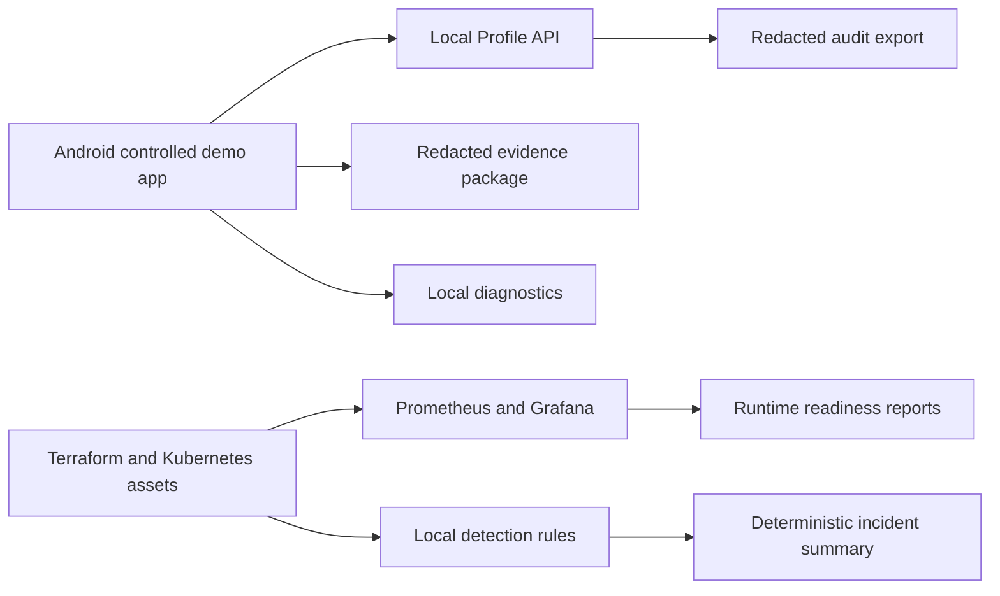

# Gozar/Gorz

Controlled local-first prototype release candidate for Android session lifecycle, local profile issuance, evidence export, diagnostics, platform automation, observability, detection logic, and deterministic incident summaries.

## Safety Disclaimer

Gozar/Gorz is for authorized local demo, research, review, and stakeholder evaluation only. It is not production secure, not a production VPN, not a public routing product, not a field-deployment routing product, and not a circumvention tool.

Safety boundaries:

- No public traffic forwarding.
- No full-device Android route.
- No public gateway discovery.
- No public relay discovery.
- No public probing.
- No automatic diagnostic upload.
- No contacts, phone number, location, or public IP history collection.

## What This Project Is

- A four-phase controlled prototype roadmap.
- A local Profile API that issues short-lived demo profiles.
- An Android Compose app with local VPN lifecycle validation, route safety, confidence scoring, diagnostics, evidence export, and safety pause.
- A platform engineering demo with Terraform, Kubernetes manifests, Prometheus/Grafana assets, SIEM-style local detection, deterministic incident summaries, and CI workflows.

## What This Project Is Not

- Not public production infrastructure.
- Not a production VPN.
- Not a public routing product.
- Not a security guarantee.
- Not suitable for sensitive communication.

## Four-Phase Roadmap

1. Phase 1: Local Profile Lifecycle
2. Phase 2: Android VpnService Prototype
3. Phase 3: Clickable Android Product Experience
4. Phase 4: Controlled Release Readiness

See [docs/product/four-phase-roadmap.md](docs/product/four-phase-roadmap.md). There is no Phase 5 in this roadmap.

## Architecture



## Repository Structure

```text
android/gorz/                 Android app
python/profile_api/           local Profile API
python/gorz_api/              local Gorz API prototype
infra/terraform/              Terraform local lab shape
deploy/kubernetes/            Kubernetes manifests and overlays
observability/                Prometheus and Grafana assets
security/detection/           local SIEM-style rules and sample events
ai/incident-summary/          deterministic incident summary demo
docs/                         product, platform, security, privacy, release docs
scripts/                      readiness, safety, screenshot, detection scripts
runtime/reports/              generated local reports
```

## Quick Start

```bash
make profile-demo
make phase4-check
make production-readiness-check
```

`phase4-check` runs safety checks, docs checks, backend validation, platform checks, report generation, and release manifest generation. Optional Android, emulator, Terraform, Kubernetes, and screenshot tooling reports SKIPPED when unavailable.

## Android Demo

Open `android/gorz` in Android Studio and run on a Pixel 2 API 30 emulator. Offline demo mode works without the local Profile API.

### Android Phase 2 Prototype

Phase 2 introduced the Android VpnService local lifecycle prototype with Profile API integration, signature verification, profile decryption, route validation, local TUN lifecycle, packet counting and dropping, and no public forwarding.

### Android Phase 3 Clickable Prototype

Phase 3 introduced the clickable Android product experience with onboarding, home, connect flow, session dashboard, confidence, route policy, diagnostics, evidence, safety pause, audit, settings, offline demo mode, and emulator smoke coverage.

### Phase 4 Controlled Release Readiness

Phase 4 adds storage hardening, route guard finalization, deterministic confidence, Evidence Package V2, local diagnostics hardening, safety pause hardening, screenshots, release reports, platform engineering assets, observability, detection rules, incident summaries, and final documentation.

```bash
make android-emulator-smoke
make android-emulator-smoke-report
make phase4-screenshots
make phase4-screenshot-report
```

## Terraform

Terraform assets live in `infra/terraform/`.

```bash
make terraform-check
```

See [docs/platform/terraform.md](docs/platform/terraform.md).

## Kubernetes

Kubernetes manifests live in `deploy/kubernetes/` with local and demo overlays. Services default to `ClusterIP`, and NetworkPolicy is included.

```bash
make k8s-check
```

See [docs/platform/kubernetes.md](docs/platform/kubernetes.md).

## Observability

Prometheus and Grafana assets live in `observability/`.

```bash
make observability-check
```

See [docs/platform/observability.md](docs/platform/observability.md).

## SIEM Detection Logic

Local YAML detection rules and redacted sample events live in `security/detection/`.

```bash
make detection-check
```

Reports are written to `runtime/reports/siem-detection-report.md` and `.json`.

## LLM-Generated Incident Summaries

The default mode is offline deterministic summarization. External LLM APIs are not enabled by default.

```bash
make incident-summary-demo
```

See [docs/ai/llm-incident-summaries.md](docs/ai/llm-incident-summaries.md).

## Screenshots

Expected screenshot paths:

- [Home](docs/vpn-product/images/phase4/phase4-home.png)
- [Connect flow](docs/vpn-product/images/phase4/phase4-connect-flow.png)
- [Route policy](docs/vpn-product/images/phase4/phase4-route-policy.png)
- [Evidence](docs/vpn-product/images/phase4/phase4-evidence.png)
- [Grafana dashboard](docs/vpn-product/images/phase4/phase4-grafana-dashboard.png)
- [Incident summary](docs/vpn-product/images/phase4/phase4-incident-summary.png)

If capture is unavailable, generated reports state SKIPPED with a reason. See [docs/vpn-product/phase-4-screenshot-guide.md](docs/vpn-product/phase-4-screenshot-guide.md).

## Demo Video

Demo video pending. See [docs/demo/demo-video-script.md](docs/demo/demo-video-script.md) for the recording plan.

Expected path:

- `docs/demo/gozar-gorz-phase4-demo.mp4`

Placeholder:

- [docs/demo/gozar-gorz-phase4-demo.placeholder.md](docs/demo/gozar-gorz-phase4-demo.placeholder.md)

## Testing And CI

Primary commands:

```bash
make phase4-check
make production-readiness-check
make terraform-check
make k8s-check
make detection-check
make incident-summary-demo
make release-candidate-manifest
```

GitHub Actions cover CI, Android, emulator smoke, production readiness, Terraform, Kubernetes, detection/AI, and release-candidate artifacts.

## Production Readiness

```bash
make production-readiness-check
```

Expected result for Phase 4:

- Controlled release readiness: PASS or PARTIAL
- Production readiness: NOT_READY

Reports are written under `runtime/reports/`.

## Known Limitations

- Android Gradle/SDK and adb may be unavailable in local shells.
- Emulator smoke and screenshots may be SKIPPED with reason.
- Android Keystore path is experimental; demo storage remains default.
- Release signing is not configured.
- Tenant auth, independent review, formal retention policy, and production crypto review remain gaps.

## Security And Privacy

- [SECURITY.md](SECURITY.md)
- [PRIVACY.md](PRIVACY.md)
- [docs/security/android-phase-4-threat-model.md](docs/security/android-phase-4-threat-model.md)
- [docs/privacy/android-phase-4-privacy-review.md](docs/privacy/android-phase-4-privacy-review.md)

## License

No repository license file is currently present. Add a reviewed license before distribution beyond controlled evaluation.
