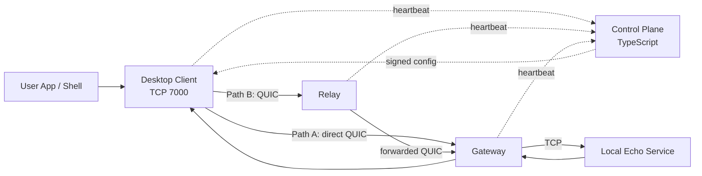

# Architecture

`gozar` is a research prototype for a resilient communications overlay that looks VPN-like to the user at the edge, but internally prefers a QUIC-first multi-path approach over a single long-lived tunnel.

## Components

- `desktop-client`: local edge component that accepts app traffic on TCP `7000`, polls the control plane, and chooses a path.
- `relay`: intermediate QUIC hop that can carry traffic when the direct path is degraded or administratively deprioritized.
- `gateway`: QUIC ingress that forwards into a local service domain.
- `echo-service`: a safe local demo target for proving end-to-end flow.
- `control-plane`: signs path preferences and receives authenticated heartbeats.

## Diagram

## Overlay Flow

1. The desktop client posts an authenticated heartbeat and fetches a signed config envelope from the control plane.
2. The control plane returns two paths: `direct` and `relay`, plus queue guidance.
3. The client listens on TCP `7000` and wraps each newline-delimited message in an overlay request.
4. The active path is selected from the signed preference, with a local fallback hook if the current path fails.
5. Each hop appends queue metadata to the request route before forwarding.
6. The gateway sends the payload to the local echo service and returns the route summary to the client.

## Per-Hop Flow Control

Every dataplane hop uses the shared `InFlightQueue` interface from `gozar-core`. It provides:

- A queue limit for bounded in-flight work.
- A queue-depth snapshot for instrumentation.
- A single acquisition point that allows a hop to reject work when saturated.

This is intentionally simple but gives the demo a clear place to evolve toward stream windows, byte accounting, and adaptive backpressure.

## Path Switching Hooks

The client has two path switching mechanisms:

- Control-plane driven: the preferred path changes when a new signed config says so.
- Runtime fallback: if the active path send fails, the fallback hook picks an alternate available path.

## Observability

- Rust services bootstrap `tracing` plus OpenTelemetry.
- The control plane registers a Node OpenTelemetry tracer provider.
- `observability/otel-collector-config.yaml` is included as a starting point for an OTLP collector.

