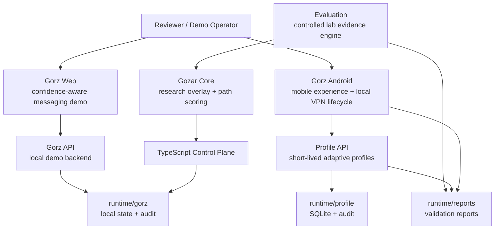

# System Map

## Architecture Diagram

## Component Table

| Component | Role | Current Boundary |
| --- | --- | --- |
| Gozar Core | Research overlay and path scoring | Lab-only, explicit research gateway mode |
| Gorz Web | Confidence-aware messaging demo | Local-first demo data and APIs |
| Gorz API | Local demo backend for Gorz Web | Simulated diagnostics and local audit |
| Profile API | Adaptive session profile backend | Short-lived demo profiles and local storage |
| Gorz Android | Mobile clickable prototype | Local VPN lifecycle only |
| Evaluation | Controlled lab evidence engine | Reproducible local scenarios |
| CI and scripts | Safety and readiness gates | Local-file checks plus best-effort builds |

## Data Flow Overview

Gorz Android requests a short-lived profile from Profile API when available. If the backend is unavailable, it uses deterministic offline demo data. Gorz Web talks to the local Gorz API for message, confidence, diagnostics, incident, audit, and safety pause flows. Gozar Core and Evaluation use local Docker services to produce controlled path-scoring evidence.

## Trust Boundaries

- User device boundary: Android local settings and local VPN lifecycle state.
- Local API boundary: Profile API and Gorz API accept local demo requests.
- Admin boundary: admin-token-protected actions remain demo-only and must be hardened before alpha.
- Runtime boundary: generated local state under `runtime/` is not production storage.
- CI boundary: workflows inspect and test repo state but do not certify production readiness.

## Local-Only Boundaries

Local-only endpoints include `localhost`, `127.0.0.1`, `10.0.2.2`, and Docker service names. Android applies `10.77.0.0/24` only and blocks the full-device route in the product experience.

## Demo-Only Crypto Boundaries

Demo profile envelopes, demo HMAC control messages, and local key material are for prototype validation only. Production use requires hardware-backed keys, tenant-aware identity, key rotation, and independent cryptographic review.

## Audit Logs

- Gorz API writes audit state in local runtime storage.
- Profile API records profile lifecycle, revocation, safety, and audit export events.
- Gorz Android records local app events in SharedPreferences-backed audit state.

## Redaction

Redaction happens in Gorz incident records, Profile API audit export, and Gorz Android evidence package generation. Raw device IDs, session IDs, message bodies, packet payloads, contacts, exact location, and public IP history are not included in evidence exports.

## Safety Pause Enforcement

Gorz Web and Gorz API enforce message-send pause. Profile API enforces profile issuance pause. Gorz Android enforces local app-level safety pause and calls Profile API pause/resume when available.
