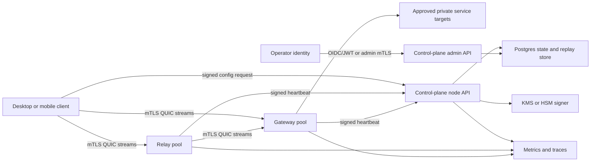

# Gozar Core Production Plan

This plan focuses on the Gozar Core multipath prototype: Rust dataplane services,
the TypeScript control plane, local Docker Compose, and the production path for
service-to-service routing. It complements the existing Gorz Android controlled
release documents; it does not change the current safety claim that this repo is
not production-ready for real use.

## Current State Review

Already implemented:

- Docker Compose local stack for control-plane, desktop-client, relay, gateway,
  and echo-service.
- Signed HMAC control messages for config, relay-directory, and heartbeats.
- Timestamp freshness and process-local replay caches.
- Signed relay directory and path-scoring based route selection.
- Bounded in-flight queues on client, relay, and gateway hops.
- Structured Rust logs through `tracing` and TypeScript audit log persistence.
- OpenTelemetry bootstrap and local observability assets.
- CI for Rust, TypeScript, Docker Compose smoke, evaluation smoke, Android,
  platform checks, dependency audit, and production-readiness reports.
- Kubernetes, Terraform, observability, detection, and readiness assets for a
  controlled local/demo shape.

Production blockers still present:

- Control-plane and dataplane trust rely on a shared HMAC secret and local admin
  token instead of node identities, scoped credentials, and key rotation.
- QUIC clients skip server certificate verification and servers generate
  process-local self-signed certificates.
- Replay protection is process-local; it does not survive restart or scale
  horizontally.
- The control plane stores operational state in local JSON and audit lines, not
  a transactional database or durable event log.
- Docker Compose still contains local demo secrets and HTTP control-plane URLs.
- Runtime images are useful for the demo but are not minimal, non-root,
  reproducible production images.
- Kubernetes manifests are controlled-demo assets, not production deployment
  manifests for the Gozar Core dataplane.
- There are no real scrape endpoints for dataplane metrics, no SLOs, and no
  alert routing ownership.
- Release provenance, image signing, SBOM publication, and admission policy are
  not complete.

## Production-Readiness Gap Analysis

| Area | Current state | Production requirement | First repo change |
| --- | --- | --- | --- |
| Admin auth | Static local token in environment and Compose | OIDC/JWT or mTLS admin identity, scoped RBAC, audit trail | Add auth interface and require non-default admin secret outside dev |
| Node identity | Shared HMAC secret for all nodes | Per-node identity, certificate/SPIFFE ID or signed bootstrap token | Add node registry and identity claims to control protocol |
| Control messages | HMAC envelopes with nonce and timestamp | Versioned canonical envelopes signed by node keys, key IDs, rotation windows | Add version/key-id fields and verifier abstraction |
| Replay protection | In-memory cache | Durable replay store or monotonic sequence per node | Add replay store interface, then Redis/Postgres implementation |
| QUIC trust | Self-signed per process and skipped verification | mTLS or pinned trust root, SAN/SPIFFE verification, cert rotation | Replace `SkipServerVerification` with configurable trust root |
| Relay discovery | Signed directory from observed heartbeats | Policy-filtered, capability-aware, rate-limited, safe relay directory | Add relay admission policy and directory validation tests |
| Data plane | Echo lab traffic and research mode gates | Authenticated streams, per-client quotas, backpressure, timeouts | Add request limits, stream timeouts, and identity-bound route policy |
| Control-plane state | Local JSON and NDJSON | Database-backed state, audit table/event log, migrations | Add storage interface and Postgres schema |
| Secrets | Local env vars and checked-in demo values | Secret manager/KMS, rotation, no default production secrets | Add `.env.example`, compose interpolation, and secret docs |
| Containers | Demo images, root runtime | Locked builds, minimal images, non-root, read-only root fs | Add production Dockerfile examples |
| Kubernetes | Controlled-demo manifests | Namespaced production manifests or Helm chart, NetworkPolicy, probes, PDBs | Add production template manifests |
| CI/CD | Good core checks, partial audits | Required audits, SBOM, image scan/sign, manifest validation, release gates | Add production workflow template |
| Observability | Logs, local reports, dashboards | Metrics endpoints, trace export, alert rules, SLOs, retention | Add metrics endpoint design and alert checklist |
| Threat model | Prototype/controlled-release docs | Production abuse, identity, key custody, operations, incident model | Add Gozar Core threat-model extension |

## Prioritized Roadmap

P0: Preserve the demo and make unsafe defaults explicit.

- Keep local development simple with `.env.example` plus `docker compose up`.
- Move demo secrets to `.env.example` and compose interpolation.
- Add startup checks that reject known demo tokens unless
  `GOZAR_ALLOW_INSECURE_DEV_DEFAULTS=true`.
- Add `/readyz` to the control plane and lightweight health endpoints for Rust
  services.

P1: Replace shared secrets with real identity boundaries.

- Introduce a `ControlAuthenticator` abstraction in TypeScript and Rust.
- Add envelope fields: `protocol_version`, `key_id`, `issuer`, `audience`,
  `expires_at_unix`, and `sequence`.
- Support a node registry with per-node public keys or certificate identities.
- Add signing-key rotation tests and old-key grace windows.
- Add durable replay storage with sequence enforcement.

P2: Harden QUIC and dataplane behavior.

- Replace self-signed ephemeral certs and skipped verification with a configured
  trust root.
- Support mTLS or equivalent workload identity for client, relay, and gateway.
- Add stream idle timeouts, max frame size, max body size, per-node quotas, and
  rate-limit metrics.
- Validate relay-directory entries against node identity, role, status, and
  policy.

P3: Make the control plane operable.

- Add Postgres-backed state, migrations, and a database health check.
- Split admin API from node API by listener, route, or ingress policy.
- Add RBAC scopes for read-state, switch-path, manage-nodes, and rotate-keys.
- Add structured audit records with actor, target, decision, and correlation ID.
- Add canary-safe config rollout and rollback.

P4: Shipable deployment and release controls.

- Build production images with locked dependencies, non-root users, read-only
  root file systems, SBOMs, image scans, and signatures.
- Add Kubernetes or Helm production templates with Secret references, PDBs,
  NetworkPolicy, probes, resources, and digest-pinned images.
- Gate releases on tests, audits, image scan, manifest validation, SBOM, and
  provenance.
- Exercise runbooks for key rotation, relay disable, path rollback, incident
  response, and data deletion.

## Target Production Architecture

Trust boundaries:

- Client-to-control and node-to-control messages are signed and replay-protected.
- Dataplane QUIC peers authenticate with mTLS or a SPIFFE-style workload
  identity.
- Admin traffic is isolated from node traffic and requires scoped operator
  identity.
- Relay discovery is signed, policy-filtered, and never public by default.
- Secrets live in a secret manager or Kubernetes Secret backed by external
  secret sync; checked-in files contain no real secret material.

## Security Hardening Plan

- Remove production fallback tokens from code paths.
- Reject known demo tokens in non-dev mode.
- Use constant-time signature comparison.
- Add protocol versioning and key IDs to every signed envelope.
- Bind every control message to method, path, actor, audience, timestamp, nonce
  or sequence, and canonical payload hash.
- Separate admin auth from node auth.
- Add scoped admin permissions and an audit record for every state mutation.
- Rotate control signing keys with overlapping verification windows.
- Store signing keys in KMS/HSM or cloud secret manager, not process env.
- Add dependency audit gates for npm, Cargo, Python, Gradle, and container base
  images.
- Add SAST and secret scanning as required release checks.

## Networking And Protocol Hardening

- Replace `SkipServerVerification` in `gozar-core/src/quic.rs`.
- Load trust roots and node certificates from files or workload identity.
- Verify peer SAN/SPIFFE identity matches the expected role and node ID.
- Add max frame size before allocating request buffers.
- Add stream read/write deadlines.
- Add per-peer and per-route rate limits.
- Add explicit protocol version negotiation.
- Add signed relay-directory entries with TTL, capabilities, region, load, and
  policy constraints.
- Add fail-closed behavior when no authenticated route is available.
- Keep research gateway mode behind operator and control-plane policy gates.

## Control-Plane Production Design

Public node API:

- `GET /healthz`: process health only.
- `GET /readyz`: dependencies ready, including DB and signer.
- `GET /api/v1/client/config`: signed request, signed response.
- `GET /api/v1/relay-directory`: signed request, signed response.
- `POST /api/v1/nodes/heartbeat`: signed node heartbeat.

Admin API:

- `GET /api/v1/admin/state`: scoped read.
- `POST /api/v1/admin/preferred-path`: scoped route switch.
- `POST /api/v1/admin/nodes/:id/disable`: relay/gateway quarantine.
- `POST /api/v1/admin/keys/rotate`: controlled key rotation.
- `GET /api/v1/admin/audit`: redacted audit export.

Storage model:

- `nodes`: registered identity, role, status, key/cert metadata.
- `heartbeats`: latest status plus append-only observations.
- `route_policies`: desired path, constraints, rollout state.
- `control_messages`: request IDs, sequence, replay status, decision.
- `audit_events`: actor, action, target, decision, reason, correlation ID.
- `signing_keys`: key IDs and state only; private material remains external.

## Dataplane Production Design

- Each node has a durable identity and short-lived workload certificate.
- Client chooses routes only from signed control-plane data.
- Relay and gateway verify peer identity before accepting streams.
- Every overlay request has trace ID, source node, target service, route policy
  ID, TTL, and payload length.
- Hops enforce queue limits, rate limits, frame limits, and stream deadlines.
- Gateways only reach allowlisted private service targets.
- Relays cannot discover arbitrary gateways; they receive signed policy.
- Backpressure is visible through metrics and used by path scoring.

## Deployment Model

Local development:

- Docker Compose stays the default developer path.
- `.env.example` documents local-only secrets and the insecure-dev flag.
- Demo services retain clear safety labels and no public ingress.

Staging:

- Kubernetes namespace per environment.
- External Postgres or managed database.
- Secret manager sync for admin auth, node bootstrap keys, and trust bundles.
- NetworkPolicy blocks public ingress by default.
- Images are digest-pinned and signed.

Production:

- Separate admin and node ingress paths.
- mTLS/service mesh or equivalent workload identity.
- Admission policy enforces non-root, read-only root filesystem, dropped
  capabilities, resource limits, signed images, and no latest tags.
- PDBs and horizontal scaling for control plane, relay, and gateway.
- Regional relay/gateway pools with controlled discovery.

## CI/CD Pipeline Design

Required for every PR:

- Rust format, clippy, tests.
- TypeScript typecheck, tests, build.
- Python and Android checks where touched.
- Safety wording, Android route, manifest, backend safety scanners.
- Docker Compose smoke for core dataplane.
- Secret scan and dependency audit.

Required before release:

- Build production images with `--locked` or `npm ci`.
- Generate SBOMs.
- Scan images and dependencies.
- Sign images and provenance.
- Validate Kubernetes/Helm manifests.
- Run e2e path switch and relay failover tests.
- Upload readiness, audit, SBOM, and scan artifacts.

## Observability And Alerting Design

Telemetry:

- JSON logs with `trace_id`, `node_id`, `role`, `path_id`, and `decision_id`.
- Metrics endpoints on every service.
- OpenTelemetry traces exported to collector.
- Audit events are separate from application logs.

Core metrics:

- `gozar_control_config_issued_total`
- `gozar_control_auth_failed_total`
- `gozar_control_replay_rejected_total`
- `gozar_node_heartbeat_age_seconds`
- `gozar_dataplane_streams_in_flight`
- `gozar_dataplane_queue_rejected_total`
- `gozar_dataplane_route_switch_total`
- `gozar_quic_handshake_failed_total`
- `gozar_relay_directory_entries`

Alerts:

- Control plane ready check failing.
- Heartbeat age above threshold for relay/gateway.
- Replay rejection spike.
- Auth failure spike.
- Queue rejection spike.
- Relay directory empty for active region.
- Error budget burn on overlay request success rate.
- Audit export or log sink failure.

## Secrets And Key Management Model

- No checked-in real secrets.
- No production default admin token or control secret.
- Local dev uses `.env` copied from `.env.example`.
- Staging/production secrets come from a managed secret store.
- Control signing keys have key IDs, creation time, activation time, and
  retirement time.
- Verification accepts current and previous keys only during a bounded rotation
  window.
- Node certificates are short lived and rotated automatically.
- Emergency rotation runbook covers admin token, control signer, node identity,
  and image signing keys.

## Threat Model Improvements

Add or expand scenarios for:

- Compromised relay attempting to advertise unsafe gateway routes.
- Stale relay-directory replay after route policy change.
- Node key compromise and quarantine.
- Admin credential compromise and scoped blast radius.
- Control-plane signer compromise.
- Service mesh or certificate authority compromise.
- Queue exhaustion and slow-stream attacks.
- Malicious contributor weakening `SkipServerVerification` replacement.
- Observability data leaking route or identity metadata.
- CI artifact tampering and unsigned image deployment.

## Concrete Repo/File Changes

Implemented so far:

- `docs/production/gozar-core-production-plan.md`
- `deploy/production/README.md`
- `deploy/production/docker/Dockerfile.rust`
- `deploy/production/docker/Dockerfile.control-plane`
- `deploy/production/kubernetes/base/*.yaml`
- `docs/production/examples/github-actions-production.yml`
- `.env.example`
- `docker-compose.yml` secret interpolation
- TypeScript and Rust startup checks for insecure local demo defaults
- CI/evaluation local-demo environment wiring

Next code commits:

1. Add control-plane `/readyz` and dependency-aware readiness tests.
3. Add Rust service health endpoints or sidecar-compatible health listeners.
4. Replace constant string signature comparison with constant-time verification.
5. Add protocol version and key ID to control envelopes.
6. Add durable replay-store interface and in-memory implementation behind it.
7. Add QUIC trust-root configuration and remove skipped server verification.
8. Add production metrics endpoints and Prometheus alert rules for core services.
9. Add database-backed control-plane storage and migrations.
10. Add production CI workflow from the inert example once secrets and registry
    names are configured.

## Phased Implementation Plan With Small Commits

Commit 1: production plan and inert templates.

- Add this document.
- Add example production Dockerfiles.
- Add example production Kubernetes base.
- Add inert GitHub Actions production workflow example.

Commit 2: explicit local-dev secrets. Complete.

- Added `.env.example`.
- Updated Compose to read `GOZAR_ADMIN_TOKEN` and `GOZAR_CONTROL_SECRET`.
- Updated local-run docs.
- Added tests for default rejection in non-dev mode.

Commit 3: readiness and config validation.

- Add `/readyz`.
- Validate required env at startup.
- Add control-plane tests for missing secrets and demo-secret rejection.

Commit 4: control protocol versioning.

- Add envelope `protocol_version` and `key_id`.
- Update TypeScript and Rust signature bases.
- Add compatibility tests.

Commit 5: durable replay abstraction.

- Add interface and in-memory implementation.
- Add Redis/Postgres design doc or first implementation.
- Add replay restart tests where storage is durable.

Commit 6: QUIC trust model.

- Add cert/trust-root config.
- Remove skipped verification.
- Add test fixtures for trusted and untrusted certs.

Commit 7: production observability.

- Add metrics endpoints.
- Add core Prometheus rules.
- Add dashboard panels for queue depth, replay rejects, auth failures, and
  heartbeat age.

Commit 8: production deployment.

- Promote templates to real manifests or Helm chart.
- Add image digests, secret references, PDBs, service accounts, and admission
  policy checks.

Commit 9: release governance.

- Enable production CI workflow.
- Add SBOM, provenance, signing, scan gates, and release evidence upload.

Commit 10: external review package.

- Update threat model.
- Package architecture, tests, runbooks, key rotation, and residual risks for
  independent security review.
