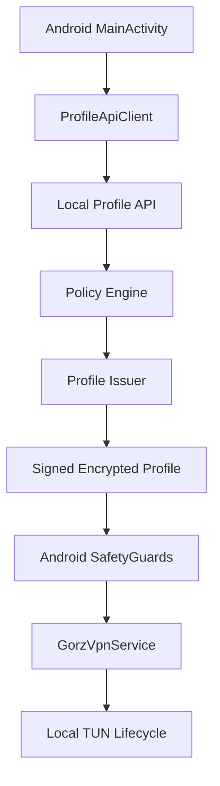

# Android App Architecture

The Android app is intentionally small. `MainActivity` owns user intent, `ProfileApiClient` talks to the local Profile API, `ProfileCrypto` verifies and decrypts the signed encrypted profile, `SafetyGuards` enforce deterministic local rules, and `GorzVpnService` opens only the controlled local TUN lifecycle.

## Components

- `MainActivity.kt`: Connect / Disconnect and Settings navigation.
- `SettingsActivity.kt`: API URL, admin token, profile status, diagnostics, revocation, and reset.
- `ProfileApiClient.kt`: health, bootstrap, device registration, profile request, validation, revocation, diagnostics, and safety calls.
- `ProfileCrypto.kt`: issuer signature verification and Android local demo envelope decryption.
- `SafetyGuards.kt`: TTL, audience, revocation, safety-note, route, endpoint, and profile-type checks.
- `GorzVpnService.kt`: Android `VpnService` lifecycle with only `10.77.0.0/24` local demo routing.
- `ProfileStateStore.kt`: minimal local metadata and demo key material storage.

## Data Boundary

The app stores profile ID, expiry, status, API URL, local admin token, and demo key material. It does not log private keys or plaintext profile payloads. Packet counters are local diagnostics only.

## Safety Boundary

This is an Android local VPN lifecycle prototype. It uses a controlled lab gateway profile shape from the local Profile API, no public gateway, no public network probing, and no public relay discovery. It is not production secure.
