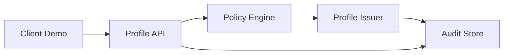

# Architecture

The Phase 1 profile system is a local Docker service plus a local demo client. It has no public gateway and does not create a VPN tunnel.

## Components

- `profile_api.main`: FastAPI routes for health, devices, profiles, diagnostics, audit, and safety.
- `device_registry`: Stores public-key registration metadata and public key hashes.
- `policy_engine`: Deterministic local policy selection.
- `profile_issuer`: Builds short-lived demo config payloads, encrypts them to the device key, signs the envelope, and stores redacted metadata.
- `issuer_keys`: Persists local demo signing keys, rotates them for tests, and keeps old public keys available for validation.
- `revocation`: Records local profile revocation state.
- `audit`: Records and exports redacted lifecycle evidence.
- `safety`: Exposes local-only safety boundaries and pause controls.

## Storage

SQLite stores devices, signed profile envelope metadata, revocation records, audit events, safety state, and local demo issuer keys. It does not store device private keys or plaintext profile payloads. The issuer private key column is local-demo-only and must be replaced by KMS, secure enclave, or HSM-backed signing before production.
