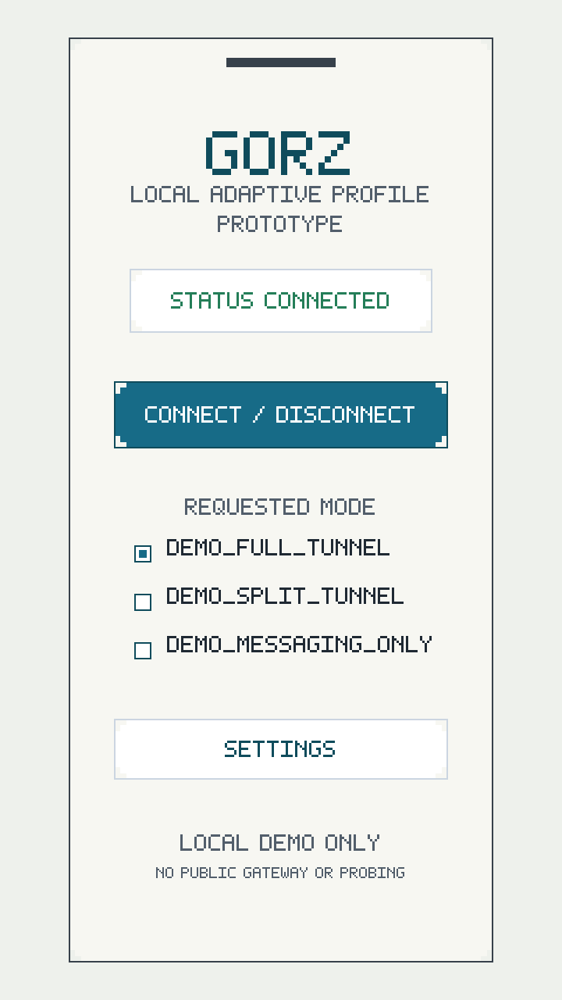

# Phase 2 Android VpnService Prototype

Phase 2 adds a minimal Android local VPN lifecycle prototype under `android/gorz`. The app has one Connect / Disconnect button and one Settings button. It requests Android `VpnService` permission, registers a demo Android device with the local Profile API, requests a short-lived signed encrypted profile, verifies the issuer signature, decrypts the Android local demo envelope, validates the adaptive session profile, and starts a controlled local `VpnService` session.

This phase is not a circumvention tool. It uses no public gateway, no public network probing, and no public relay discovery. It is not production secure and not for real sensitive communication.

## What Phase 2 Adds

- Android Kotlin app prototype.
- Connect / Disconnect lifecycle.
- Settings screen for API URL, local admin token, profile status, and diagnostics.
- Android `VpnService` permission and service lifecycle integration.
- Android local demo envelope mode for local prototype crypto.
- Safety guards for TTL, audience, revocation, routing, endpoint, and safety notes.
- Revocation and diagnostics actions from Settings.

## What Phase 2 Does Not Add

- No production VPN service.
- No public gateway.
- No public network probing.
- No public relay discovery.
- No packet forwarding to the public internet.
- No route for `0.0.0.0/0`.
- No iOS implementation.

## Run The Profile API

From the repository root:

```bash
make profile-demo
```

The local Profile API listens on `http://127.0.0.1:8095`. Android emulator networking reaches host localhost through:

```text
http://10.0.2.2:8095
```

## Open The Android Project

Open `android/gorz` in Android Studio and run the `app` configuration on an emulator. The default Profile API URL is already `http://10.0.2.2:8095`.

## Prototype Screenshot

The prototype UI is intentionally small: status, one Connect / Disconnect control, requested-mode selection, Settings, and a safety footer.



## Connect / Disconnect Lifecycle

1. Tap Connect.
2. Android asks for `VpnService` consent if needed.
3. The app generates or loads local demo device key material.
4. The app registers the device with the local Profile API.
5. The app requests a signed encrypted profile with the selected requested mode and `android_local_demo` envelope mode.
6. The app verifies the issuer signature.
7. The app decrypts the short-lived demo config locally.
8. The app validates TTL, audience, revocation status, route scope, endpoint scope, and safety notes.
9. `GorzVpnService` opens a local TUN interface with `10.77.0.2/32`.
10. The app displays Connected.
11. Tap Disconnect to stop the controlled local service session.

## Routing Boundary

Phase 2 only adds the local demo route `10.77.0.0/24`. It does not add `0.0.0.0/0` because this prototype is for lifecycle validation, not full-device traffic handling. `GorzVpnService` reads packets only to count and drop them for local diagnostics. It does not forward packets externally.

## Requested Modes

The Android app lets the user choose the requested mode before tapping Connect. The selected value is sent to the local Profile API as `requested_mode`.

- `demo_full_tunnel`: requests a full-tunnel-shaped profile decision, but Phase 2 still constrains the resulting Android service to the local demo boundary. No device-wide route is added.
- `demo_split_tunnel`: requests the WireGuard-like local demo profile and uses the local demo route `10.77.0.0/24`.
- `demo_messaging_only`: requests the QUIC-like demo profile. In Phase 2 this does not add the local demo route to the Android service.

Only the messaging-only and split-tunnel paths affect local demo route selection in Phase 2. No `0.0.0.0/0` route is ever added.

## Profile API Compatibility

The Profile API supports two envelope modes:

- `sealed_box`: the Phase 1 default. The backend encrypts the profile payload to the registered device public key with the PyNaCl sealed-box path, then signs the canonical envelope. The Python demo client can decrypt this mode locally with its demo private key.
- `android_local_demo`: the Android Phase 2 compatibility mode. The backend keeps the same signed envelope shape, but encrypts the profile payload with an Android-friendly local demo AEAD path so the minimal Kotlin app can verify, decrypt, and validate the profile without adding a heavier native crypto dependency.

Both modes keep the issuer signature check outside the encrypted payload. The Android mode does not replace or weaken the Phase 1 `sealed_box` path; it is a local prototype compatibility path and is not production secure.

## Blocked Scenarios

Blocked diagnostic scenarios are denied by the deterministic policy engine rather than routed around. The app surfaces the denial as a profile error and does not attempt alternate public endpoints.

## Testing

```bash
make android-check
make phase2-check
```

`android-check` validates structure and safety wording. If Java, Gradle, and the Android SDK are installed, it also runs Android unit tests.

## Known Limitations

- Local demo key material may be stored in normal app preferences for the prototype.
- The app does not forward traffic.
- The Android local demo envelope mode is for emulator and lab use only.
- The UI is intentionally minimal.
- The prototype is not production secure and not for real sensitive communication.

Readers interested in the next platform can review the documentation-only [future iOS plan](future-ios-plan.md).
