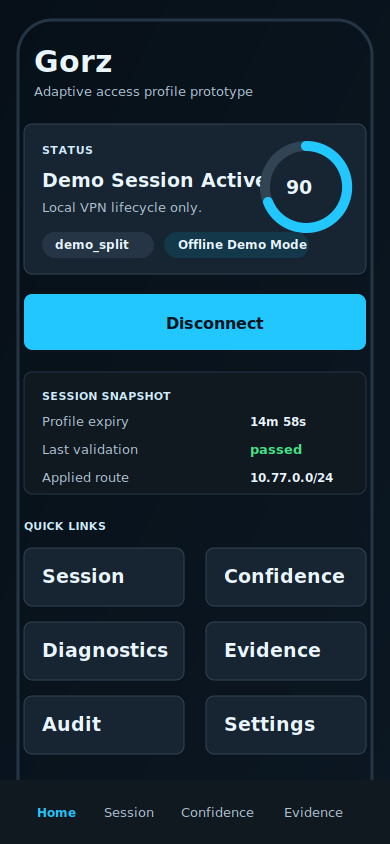
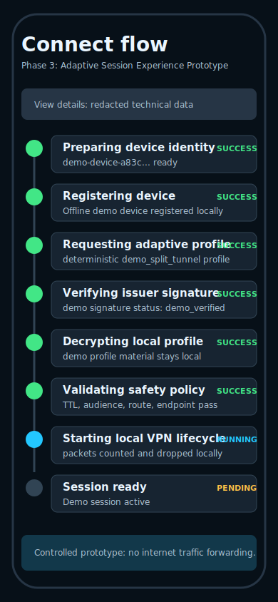
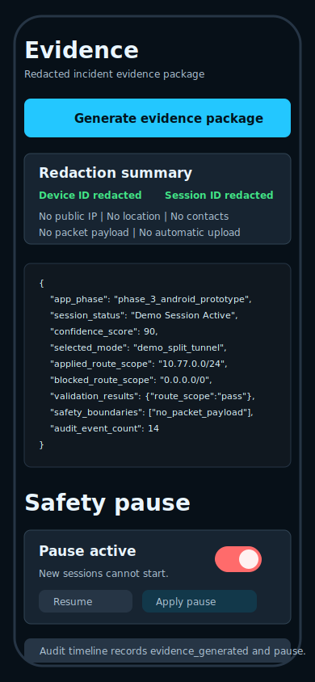

# Phase 3 Android Clickable Prototype

## Goal

Phase 3 turns the Android app into a clickable product experience prototype for adaptive, confidence-aware local session management. It remains a controlled prototype, not production secure, and not a circumvention tool.

## What Changed

- Added a Jetpack Compose Material 3 app shell under `android/gorz`.
- Added onboarding, home, staged connect, session, confidence, route policy, diagnostics, evidence, safety pause, audit, and settings screens.
- Added an offline demo repository so the app is demoable without the local Profile API.
- Added confidence scoring, evidence generation, diagnostics, audit, and safety pause use cases.
- Added `make phase3-check` and `scripts/check_phase3_safety.py`.

## Screens







- Onboarding: simple product framing and prototype safety note.
- Home: status, connect action, confidence, profile expiry, validation, and quick links.
- Connect flow: staged lifecycle from device identity through local VPN lifecycle.
- Session: redacted session details and packet counters.
- Confidence: score and signal cards.
- Route policy: requested mode, applied `10.77.0.0/24`, and blocked `0.0.0.0/0`.
- Diagnostics: local health and mock path quality only.
- Evidence: redacted JSON package preview and export.
- Safety pause: local or backend-backed pause and resume.
- Audit: local redacted timeline.
- Settings: API URL, demo mode, offline mode, reset, and clear actions.

## Architecture

The Phase 3 app keeps the Phase 2 `VpnService`, `ProfileApiClient`, profile crypto, and safety guards. New code is organized into:

- `data/model`: UI-safe session, validation, confidence, diagnostics, evidence, audit, safety, and mode models.
- `data/repository`: profile fallback, local demo profile generation, settings, diagnostics, evidence, and audit storage.
- `domain`: connect orchestration, validation, confidence scoring, route guard, diagnostics, evidence, and safety pause use cases.
- `state`: `GorzViewModel` and `GorzAppState`.
- `ui`: Compose screens and reusable components.

## Offline Demo Mode

When the Profile API is unavailable, or when the operator enables offline mode, the app uses deterministic local demo data:

- `demo-device-<short hash>`
- `demo-session-<timestamp>`
- `android-gorz-demo` audience
- `10.77.0.0/24` applied route
- `0.0.0.0/0` blocked route
- `controlled_lab_only` gateway profile
- `demo_verified` signature status
- `demo_decrypted` encryption status

The UI labels this as Offline Demo Mode and does not claim a real tunnel is active.

## Backend-Connected Mode

With `make profile-demo` running, the emulator uses `http://10.0.2.2:8095`. The app registers the device, requests a signed encrypted profile, verifies the issuer signature, decrypts the Android local demo payload, validates TTL, audience, revocation, safety notes, endpoint scope, route scope, and selected mode, then starts the local Android VPN lifecycle.

## Safety Boundaries

- No public gateway.
- No public gateway discovery.
- No public network probing.
- No public relay discovery.
- No internet traffic forwarding.
- No full-device Android route.
- No phone number, contacts, exact location, or public IP history collection.
- No automatic diagnostic upload.
- Packets may be counted locally and are dropped.

## How To Run

```bash
make profile-demo
```

Open `android/gorz` in Android Studio, run the `app` configuration on an emulator, and keep the default Profile API URL:

```text
http://10.0.2.2:8095
```

For checks:

```bash
make android-check
make phase3-check
```

## How To Demo

Use the app without starting the backend to show offline mode, then run `make profile-demo` to show backend-connected mode. In both cases, the route policy screen should show `10.77.0.0/24` as the only applied Android route and `0.0.0.0/0` as blocked.

## Acceptance Criteria

- Android Studio opens `android/gorz`.
- The app launches and onboarding can be completed.
- Connect works with the backend or offline fallback.
- VPN permission can be granted.
- The app shows Demo Session Active or Local VPN lifecycle active language.
- Confidence, route policy, diagnostics, evidence, safety pause, audit, and settings are clickable.
- Safety pause blocks new sessions and resume restores the demo.
- Disconnect works.
- Existing Phase 2 checks still pass.
- `make phase3-check` passes in an environment with the expected local toolchain.

## Known Limitations

- This is a product experience prototype, not a networking breakthrough.
- The Android VPN service validates local lifecycle behavior only.
- Offline demo data is deterministic mock data.
- Evidence export is redacted and local; it is not automatically uploaded.
- Android UI tests are intentionally light until a full Android CI image is available.

## Next Phase Recommendation

Phase 4 should focus on hardening product telemetry boundaries, richer operator demo controls, and CI coverage for Compose UI flows while preserving the same local-only profile lifecycle constraints.
